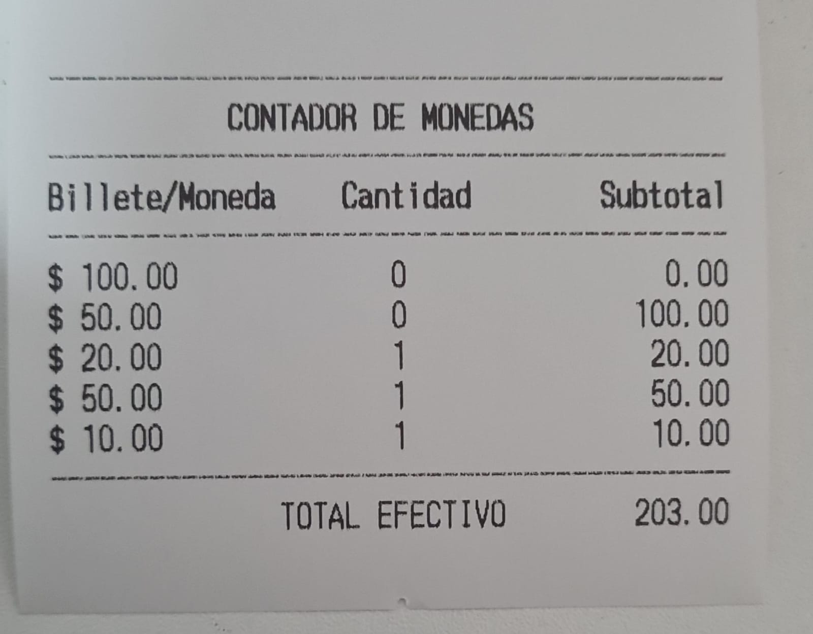

# Ejemplos de diseño para Tablas

## Alineaciones personalizadas para columnas 1 y 2 en el body usando CellBodyStyles

```json
{
	"printer": {
		"properties": {
			"width": 42
		}
	}
  "tables": [
    {
      "cellBodyStyles": {
        "1": "center",
        "2": "right"
      },
      "title": "CONTADOR DE MONEDAS",
      "headers": [
        "Billete/Moneda",
        "Cantidad",
        {
          "text": "Subtotal",
          "align": "right"
        }
      ],
      "body": [
        ["$ 100.00", "0", "0.00"],
        ["$ 50.00", "0", "100.00"],
        ["$ 20.00", "1", "20.00"],
        ["$ 50.00", "1", "50.00"],
        ["$ 10.00", "1", "10.00"]
      ]
    }
  ]
}
```



